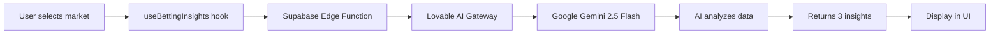

# AI-Powered Betting Insights Integration Guide

## ✨ What's New

Your EdgeGuide app now has **real AI-powered betting analysis** using Lovable AI! Instead of mock data, you get genuine insights based on betting splits, line movements, and market dynamics.

## 🔧 What Was Set Up

### 1. Backend Edge Function (`supabase/functions/betting-insights/index.ts`)
- Calls Lovable AI Gateway (Google Gemini 2.5 Flash)
- Analyzes betting data and generates three insights:
  - **What Vegas Needs** - Bookmaker liability analysis
  - **Sharpest Play** - Where the smart money is going
  - **What The Public Is Hammering** - Most popular public bets
- Handles rate limits (429) and credit exhaustion (402) gracefully
- No API key needed - automatically configured!

### 2. React Hook (`src/hooks/useBettingInsights.ts`)
- Easy-to-use hook that fetches AI insights
- Manages loading states and errors
- Shows user-friendly toasts for rate limits and errors
- Automatically retries on market changes

### 3. Example Component (`src/components/AIAnalysisCardExample.tsx`)
- Drop-in replacement for your current `AIAnalysisCard`
- Shows how to use the `useBettingInsights` hook
- Displays loading states with spinners
- Gracefully handles errors with fallback messages

## 📝 How to Integrate Into Your Existing Code

### Step 1: Update Your `AIAnalysisCard` Component

Replace your current `AIAnalysisCard` component with the pattern from `AIAnalysisCardExample.tsx`:

```tsx
// In your existing file where AIAnalysisCard is defined
import { useBettingInsights } from "@/hooks/useBettingInsights";
import { Loader2 } from "lucide-react";

export function AIAnalysisCard({ game, sport }: { game: any; sport: string }) {
  const [selectedMarket, setSelectedMarket] = useState<Market>("Spread");

  // Build parameters for AI analysis
  const analysisParams = useMemo(() => {
    // ... construct params from your game data ...
    // See AIAnalysisCardExample.tsx for full implementation
  }, [game, selectedMarket]);

  // Replace generateAIInsights with this:
  const { insights, loading, error } = useBettingInsights(analysisParams);

  return (
    <div>
      {/* ... your existing header and market toggle ... */}

      {/* Replace your insights rendering with: */}
      {loading ? (
        <div className="flex items-center justify-center py-12">
          <Loader2 className="w-8 h-8 animate-spin text-primary" />
        </div>
      ) : (
        <div className="space-y-3">
          {/* Use insights.bookNeed, insights.sharpSide, insights.publicSide */}
        </div>
      )}
    </div>
  );
}
```

### Step 2: Remove Old Mock Logic

Delete or comment out:
- `generateAIInsights` function from `utils/aiAnalysis.ts`
- Any hash-based mock data generation
- Hardcoded insight text

### Step 3: Test the Integration

1. Open your app and navigate to a game with AI analysis
2. Select different markets (ML, Spread, Total)
3. Watch the loading spinner while AI generates insights
4. Verify insights update when you change markets

## 🎯 How It Works



## 💡 Key Features

✅ **Real AI Analysis** - Powered by Google Gemini 2.5 Flash  
✅ **No API Keys Needed** - Pre-configured with Lovable Cloud  
✅ **Auto-Updates** - Insights refresh when market changes  
✅ **Error Handling** - Graceful fallbacks for rate limits/errors  
✅ **Loading States** - Smooth UX with spinners  
✅ **Cost-Efficient** - Free monthly usage included  

## 🔐 Security & Privacy

- Edge function runs server-side (no API keys exposed to client)
- Betting data is analyzed in real-time (not stored)
- Rate limits prevent abuse
- No authentication required (public endpoint)

## 📊 Understanding the Insights

### What Vegas Needs
- Shows which side bookmakers need to win based on betting liability
- Calculated from money vs. ticket percentages
- Example: "Patriots -3.5. Sharp money creating liability with 70% of handle."

### Sharpest Play
- Identifies where professional/sharp bettors are placing money
- Looks for divergence between % of tickets vs. % of money
- Example: "Bills +3.5. Big money on small ticket count signals sharp action."

### What The Public Is Hammering
- Shows the most popular public bet
- Based on ticket percentages
- Example: "Chiefs -7. Public loves the favorite with 68% of tickets."

## ⚠️ Rate Limits & Credits

- **Free Usage**: Included monthly AI credits
- **429 Error**: Too many requests - wait a moment and retry
- **402 Error**: Credits exhausted - top up in Settings → Workspace → Usage

The app automatically shows user-friendly toasts when these limits are hit.

## 🚀 Next Steps

1. Replace your `AIAnalysisCard` component with the new pattern
2. Test with different markets and games
3. Customize the insight display to match your design
4. Monitor usage in Lovable Cloud dashboard

## 🆘 Troubleshooting

**Insights not loading?**
- Check browser console for errors
- Verify game data has `splits` and `odds` properties
- Ensure Lovable Cloud is enabled

**"Analysis unavailable" message?**
- Could be a temporary API issue
- Check rate limits (429) or credits (402)
- Refresh the page to retry

**Loading takes too long?**
- Normal response time is 2-4 seconds
- Edge function has 30-second timeout
- Network issues may cause delays

## 📚 Learn More

- [Lovable AI Documentation](https://docs.lovable.dev/features/ai)
- [Lovable Cloud Guide](https://docs.lovable.dev/features/cloud)
- [Edge Functions Reference](https://docs.lovable.dev/features/cloud/edge-functions)

---

**Need help?** Check the `AIAnalysisCardExample.tsx` file for a complete working example!
