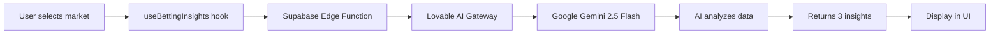

# AI-Powered Betting Insights Integration Guide

## ✨ What's New

Your EdgeGuide app now has **real AI-powered betting analysis** using Lovable AI! Instead of mock data, you get genuine insights based on betting splits, line movements, and market dynamics.

## 🔧 What Was Set Up

### 1. Backend Edge Function (`supabase/functions/betting-insights/index.ts`)
- Calls Lovable AI Gateway (Google Gemini 2.5 Flash)
- Analyzes betting data and generates three insights:
  - **What Vegas Needs** - Bookmaker liability analysis
  - **Sharpest Play** - Where the smart money is going
  - **What The Public Is Hammering** - Most popular public bets
- Handles rate limits (429) and credit exhaustion (402) gracefully
- No API key needed - automatically configured!

### 2. React Hook (`src/hooks/useBettingInsights.ts`)
- Easy-to-use hook that fetches AI insights
- Manages loading states and errors
- Shows user-friendly toasts for rate limits and errors
- Automatically retries on market changes

### 3. Integration in Feed Page (`src/pages/Feed.tsx`)
- AI insights integrated directly into the Feed component
- Uses the `useBettingInsights` hook with real-time data
- Displays loading states with spinners
- Gracefully handles errors with fallback messages

## 📝 Current Implementation

### How AI Analysis Works in Feed.tsx

The AI insights are now fully integrated into the Feed component:

```tsx
// In src/pages/Feed.tsx
import { useBettingInsights } from "@/hooks/useBettingInsights";
import { Loader2 } from "lucide-react";

// Inside the AIAnalysisCard component
const analysisParams = useMemo(() => ({
  gameId: game.id,
  sport: sport.toUpperCase(),
  homeTeam: game.home,
  awayTeam: game.away,
  market: selectedMarket,
  homeBetsPct: game.splits?.home.betsPct,
  homeMoneyPct: game.splits?.home.moneyPct,
  awayBetsPct: game.splits?.away.betsPct,
  awayMoneyPct: game.splits?.away.moneyPct,
  move: game.movement?.[0],
}), [game, selectedMarket, sport]);

const { insights, loading, error } = useBettingInsights(analysisParams);

// Display insights with loading states
{loading ? (
  <div className="flex items-center justify-center py-12">
    <Loader2 className="w-8 h-8 animate-spin text-primary" />
  </div>
) : error ? (
  <p className="text-sm text-muted-foreground text-center py-8">
    Analysis unavailable. Please try again.
  </p>
) : insights ? (
  <div className="space-y-3">
    {/* Render insights.bookNeed, insights.sharpSide, insights.publicSide */}
  </div>
) : null}
```

### Key Features in Production

✅ **Real-time AI Generation** - Insights generated on-demand for each game  
✅ **Market-Aware** - Updates automatically when user changes ML/Spread/Total  
✅ **Error Resilience** - Graceful fallbacks for API issues  
✅ **Loading States** - Clear feedback during analysis  
✅ **No Mock Data** - All insights powered by Google Gemini 2.5 Flash

### Test the Integration

1. Open your app and navigate to a game with AI analysis
2. Select different markets (ML, Spread, Total)
3. Watch the loading spinner while AI generates insights
4. Verify insights update when you change markets

## 🎯 How It Works



## 💡 Key Features

✅ **Real AI Analysis** - Powered by Google Gemini 2.5 Flash  
✅ **No API Keys Needed** - Pre-configured with Lovable Cloud  
✅ **Auto-Updates** - Insights refresh when market changes  
✅ **Error Handling** - Graceful fallbacks for rate limits/errors  
✅ **Loading States** - Smooth UX with spinners  
✅ **Cost-Efficient** - Free monthly usage included  

## 🔐 Security & Privacy

- Edge function runs server-side (no API keys exposed to client)
- Betting data is analyzed in real-time (not stored)
- Rate limits prevent abuse
- No authentication required (public endpoint)

## 📊 Understanding the Insights

### What Vegas Needs
- Shows which side bookmakers need to win based on betting liability
- Calculated from money vs. ticket percentages
- Example: "Patriots -3.5. Sharp money creating liability with 70% of handle."

### Sharpest Play
- Identifies where professional/sharp bettors are placing money
- Looks for divergence between % of tickets vs. % of money
- Example: "Bills +3.5. Big money on small ticket count signals sharp action."

### What The Public Is Hammering
- Shows the most popular public bet
- Based on ticket percentages
- Example: "Chiefs -7. Public loves the favorite with 68% of tickets."

## ⚠️ Rate Limits & Credits

- **Free Usage**: Included monthly AI credits
- **429 Error**: Too many requests - wait a moment and retry
- **402 Error**: Credits exhausted - top up in Settings → Workspace → Usage

The app automatically shows user-friendly toasts when these limits are hit.

## 🚀 Current Status

✅ AI insights are fully integrated in the Feed page  
✅ Real-time analysis using Google Gemini 2.5 Flash  
✅ All mock data and deprecated patterns removed  
✅ Clean architecture with single source of truth

### Monitor Your Usage
Check AI credit usage in your Lovable Cloud dashboard to track API consumption.

## 🆘 Troubleshooting

**Insights not loading?**
- Check browser console for errors
- Verify game data has `splits` and `odds` properties
- Ensure Lovable Cloud is enabled

**"Analysis unavailable" message?**
- Could be a temporary API issue
- Check rate limits (429) or credits (402)
- Refresh the page to retry

**Loading takes too long?**
- Normal response time is 2-4 seconds
- Edge function has 30-second timeout
- Network issues may cause delays

## 📚 Learn More

- [Lovable AI Documentation](https://docs.lovable.dev/features/ai)
- [Lovable Cloud Guide](https://docs.lovable.dev/features/cloud)
- [Edge Functions Reference](https://docs.lovable.dev/features/cloud/edge-functions)

---

**Need help?** Check the `src/pages/Feed.tsx` file for the complete implementation!
